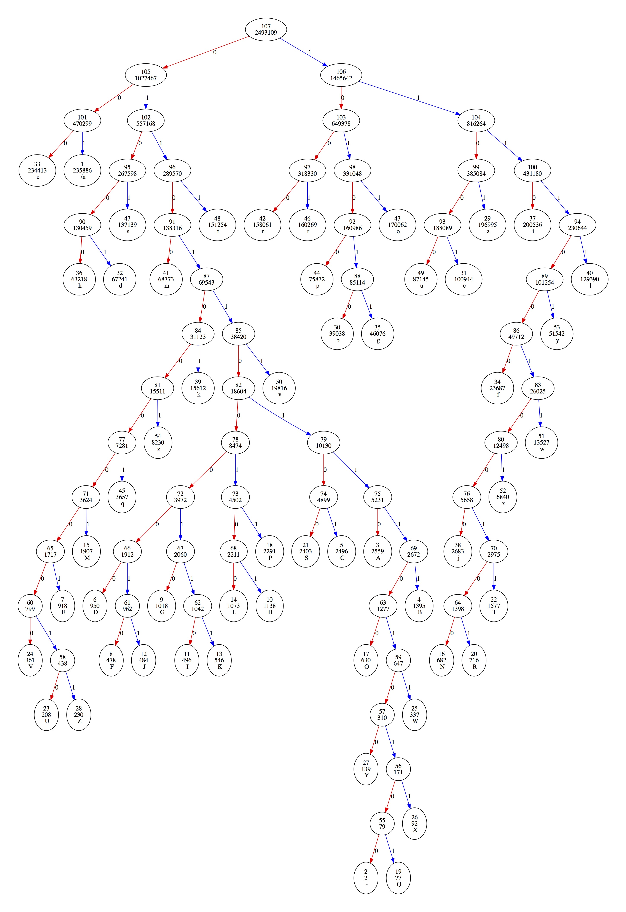

Huffman Coding (Greedy Algorithms) in Java
========================

## Introduction
This repository was created to share my project in "Data Structures and Algorithms in Java" class.   
What I did in the project are:

* Implemented Huffman Coding in Java
* Implemented function to automatically generate .dot file for Graphviz software to visualize the Huffman Tree
* Tested the code with Unix's words file (/usr/share/dict/words)
* Get the result of data compression rate


## Key techniques used
* Greedy Algorithms
* HashMap
* PriorityQueue (Min Heap)
* Nested Class
* Recursion


## Requirements
Graphviz software is required to visualize the Huffman Tree.  
Please download it on [here](http://www.graphviz.org)


## How to test

#### 1. Prepare your own text file

Create a text file named "original.txt" under /files with any contents.
In this demo, I used Unix's words file which contains 235,886 dictionary words(2,493,109 characters in total).

```
$ cd <PATH TO THE PROJECT DIRECTORY>/files
$ cat /usr/share/dict/words > original.txt
```


#### 2. Run the test code
"Test.java" automatically loads the original.txt, then test encoding/decoding the given text, and will show the result of text compression.  
The actual result will be something like below.

```
----- Test.java START -----
* Loading the file...DONE
* Builiding Huffman Tree and Code Tables... DONE

============= Word Frequency =============
\n occurs 235886 times
- occurs 2 times
A occurs 2559 times
B occurs 1395 times
C occurs 2496 times
D occurs 950 times
E occurs 918 times
F occurs 478 times
G occurs 1018 times
H occurs 1138 times
I occurs 496 times
J occurs 484 times
K occurs 546 times
L occurs 1073 times
M occurs 1907 times
N occurs 682 times
O occurs 630 times
P occurs 2291 times
Q occurs 77 times
R occurs 716 times
S occurs 2403 times
T occurs 1577 times
U occurs 208 times
V occurs 361 times
W occurs 337 times
X occurs 92 times
Y occurs 139 times
Z occurs 230 times
a occurs 196995 times
b occurs 39038 times
c occurs 100944 times
d occurs 67241 times
e occurs 234413 times
f occurs 23687 times
g occurs 46076 times
h occurs 63218 times
i occurs 200536 times
j occurs 2683 times
k occurs 15612 times
l occurs 129390 times
m occurs 68773 times
n occurs 158061 times
o occurs 170062 times
p occurs 75872 times
q occurs 3657 times
r occurs 160269 times
s occurs 137139 times
t occurs 151254 times
u occurs 87145 times
v occurs 19816 times
w occurs 13527 times
x occurs 6840 times
y occurs 51542 times
z occurs 8230 times

========== Huffman Code for each character =============
\n: 001
-: 0110110111010100
A: 0110110110
B: 01101101111
C: 0110110101
D: 01101100000
E: 01101000001
F: 011011000010
G: 01101100010
H: 01101100101
I: 011011000110
J: 011011000011
K: 011011000111
L: 01101100100
M: 0110100001
N: 111100100100
O: 011011011100
P: 0110110011
Q: 0110110111010101
R: 111100100101
S: 0110110100
T: 11110010011
U: 0110100000010
V: 011010000000
W: 0110110111011
X: 011011011101011
Y: 01101101110100
Z: 0110100000011
a: 1101
b: 101010
c: 11001
d: 01001
e: 000
f: 1111000
g: 101011
h: 01000
i: 1110
j: 1111001000
k: 0110101
l: 11111
m: 01100
n: 1000
o: 1011
p: 10100
q: 011010001
r: 1001
s: 0101
t: 0111
u: 11000
v: 0110111
w: 11110011
x: 111100101
y: 111101
z: 01101001

* Encoding the text... DONE
* Decoding the encoded text... DONE

========== RESULT ==========
Original string cost = 17451763 bits
Encoded  string cost = 10872876 bits
% reduction = 37.697549525512116

----- Test DONE ----- 


```

> The program will automatically create "test.dot" for visualizing the tree.


#### 3. Visualize the tree with Graphviz

Run below command and it will create test.pdf which visualized the Huffman Tree built for the test

```
$ dot -Tpdf test.dot -o test.pdf
```

It will create a pdf file like below.

   

Each circle represents a tree node with below properties.
* Unique ID of a node
* Weight of a node
* Character (leaf nodes only)


